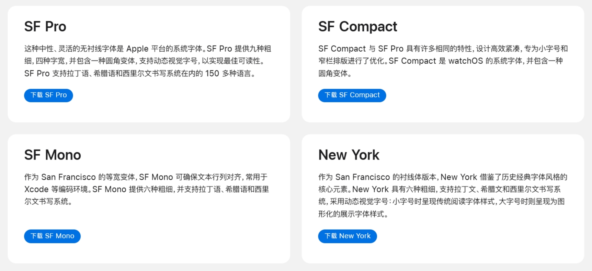

# San Francisco 字体

> `San Francisco` 是一种 Apple 设计的字体，可提供一致、清晰且友好的排印风格。在所有 Apple 产品中，San Francisco 字体采用针对不同字号的轮廓设计和动态字距，确保在任意磅值大小与屏幕分辨率下均实现最佳可读性。数字默认采用比例宽度，使其在用户常用的时间和数据密集型界面中显得排布均匀、疏密得当。 
>  
> 该字体提供包括斜体在内的九种粗细，并支持小型大写字母、分数、上标和下标数字、索引、箭头等特性，为精准排版提供了全面且专业的支持。San Francisco 还能智能适应不同使用场景。例如，在显示时间时，San Francisco 的冒号会自动切换为垂直居中的形式。各个操作系统还会根据字样自动应用特定于字号的字体特性。  
> 
> ***摘自 [Apple 开发者](https://developer.apple.com/fonts/)***

本仓库用来存储提取的 `otf`、`ttf` 文件。

<table>
    <tr>
        <td><b>字体名称</b></td>
        <td><b>路径</b></td>
        <td><b>版本</b></td>
        <td><b>ID</b></td>
    </tr>
    <tr>
        <td>SF Pro</td>
        <td><a href='./SF-Pro/'>./SF-Pro/</a></td>
        <td>7.0.1.1757634942</td>
        <td>SFProFonts</td>
    </tr>
    <tr>
        <td>SF Compact</td>
        <td><a href='./SF-Compact/'>./SF-Compact/</a></td>
        <td>7.0.1.1757634942</td>
        <td>SFCompactFonts</td>
    </tr>
    <tr>
        <td>SF Mono</td>
        <td><a href='./SF-Mono/'>./SF-Mono/</a></td>
        <td>6.0.1.1726709071</td>
        <td>SFMonoFonts</td>
    </tr>
    <tr>
        <td>New York</td>
        <td><a href='./NewYork/'>./NewYork/</a></td>
        <td>6.0.1.1726709071</td>
        <td>NYFonts</td>
    </tr>
</table>

## 提取方法

- 从 [官网链接](https://developer.apple.com/fonts/) 下载文件 `xxx.dmg`；
- 使用解压工具得到 `xxx.pkg`；
- 使用解压工具得到 `Payload`；
- 添加后缀名 `.gz`，使用解压工具得到 `Payload`；
- 添加后缀名 `.cpio`，使用解压工具得到字体文件夹。

## 字体版权声明

所有字体文件版权归 Apple Inc. 所有。  
这些字体仅供个人学习、测试和研究使用。

请遵守 Apple 的最终用户许可协议（EULA）。  
不得用于商业用途或未经授权的分发。